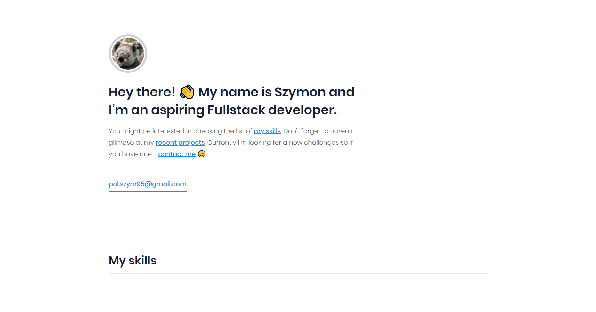

# Klewerro.github.io

My personal website hosted on github pages. Page created based on the Figma project.
You can visit page by clicking [here](https://klewerro.github.io/) or by using link above. 

## Technologies used:
- HTML
- SASS (SCSS)
- Javascript 
- NPM
- GULP

## How to run project locally
Type in console inside downloaded project:
1. `npm install -g gulp-cli`
2. `npm install`
3. `gulp` 